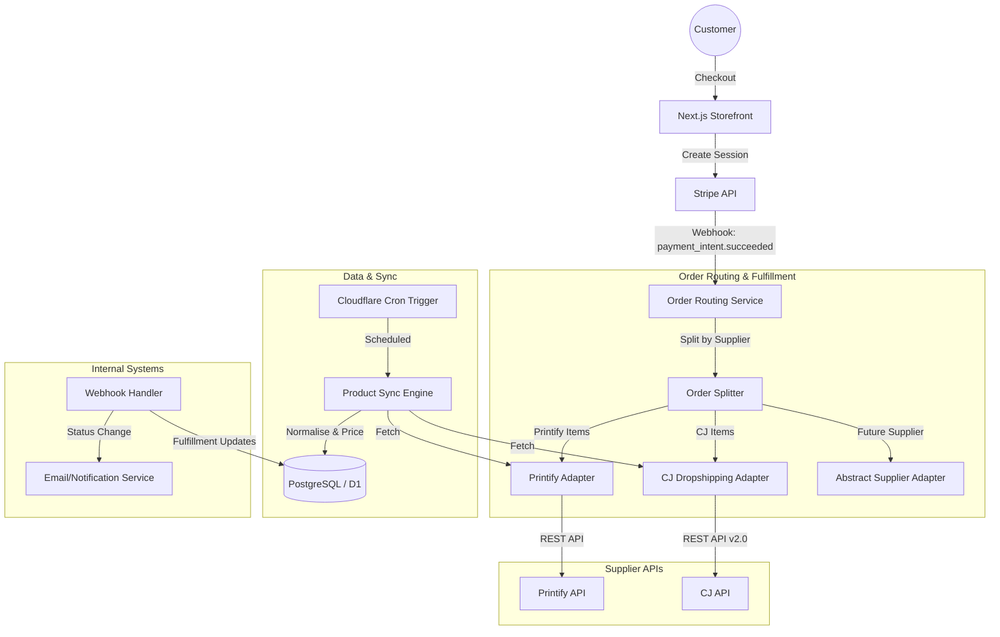

# Technical Architecture: Modular Multi-Supplier Dropshipping System

This document outlines the architecture for a production-ready, multi-supplier e-commerce integration using Next.js, Stripe, D1/Prisma, and Cloudflare.

## 1. High-Level Architecture Diagram



---

## 2. Suggested Folder Structure (Next.js)

```text
/
├── app/
│   ├── api/
│   │   ├── webhooks/
│   │   │   ├── stripe/route.ts      # Main payment success handler
│   │   │   ├── cj/route.ts          # CJ delivery tracking updates
│   │   │   └── printify/route.ts    # Printify status updates
│   │   └── admin/
│   │       └── sync/route.ts        # Manual trigger for sync
│   └── (storefront)/                # Shop pages
├── services/
│   ├── suppliers/                   # Modular Adapter Pattern
│   │   ├── types.ts                 # Shared interfaces
│   │   ├── index.ts                 # Registry & Factory
│   │   ├── base.adapter.ts          # Abstract Base Class
│   │   ├── printify.adapter.ts      # Printify Implementation
│   │   └── cj.adapter.ts            # CJ Implementation
│   ├── inventory/
│   │   └── sync.service.ts          # Normalization & Pricing Logic
│   └── orders/
│       └── router.service.ts        # Splitting & Routing Logic
├── lib/
│   ├── prisma.ts                    # DB Client
│   └── stripe.ts                    # Stripe Client
└── prisma/
    └── schema.prisma                # Relational Schema
```

---

## 3. Database Schema (Prisma)

```prisma
// This schema supports multi-supplier tracking and mixed-cart orders.

model Supplier {
  id               String   @id @default(cuid())
  slug             String   @unique // 'printify', 'cj', etc.
  name             String
  isActive         Boolean  @default(true)
  apiKey           String?  // Securely handle via Env or DB with encryption
  shopId           String?  // For Printify
  accessToken      String?  // For suppliers with OAuth/Bearer
  tokenExpiresAt   DateTime?
  products         Product[]
  supplierOrders   SupplierOrder[]
}

model Product {
  id              String   @id @default(cuid())
  supplierId      String
  externalId      String   @unique // PID from supplier
  title           String
  description     String   @db.Text
  images          String[] @default([])
  supplier        Supplier @relation(fields: [supplierId], references: [id])
  variants        ProductVariant[]
}

model ProductVariant {
  id               String   @id @default(cuid())
  productId        String
  externalId       String   @unique // Variant ID from supplier
  sku              String?  @unique
  costPrice        Decimal  @db.Decimal(10, 2)
  salePrice        Decimal  @db.Decimal(10, 2)
  stock            Int      @default(0)
  attributes       Json?    // Size, Color, etc.
  product          Product  @relation(fields: [productId], references: [id], onDelete: Cascade)
  orderItems       OrderItem[]
}

model Order {
  id               String   @id @default(cuid())
  stripePaymentId  String   @unique
  customerEmail    String
  customerName     String
  shippingAddress  Json
  totalAmount      Decimal  @db.Decimal(10, 2)
  status           String   @default("paid") // paid, processing, shipped, completed
  createdAt        DateTime @default(now())
  items            OrderItem[]
  supplierOrders   SupplierOrder[]
}

model OrderItem {
  id               String         @id @default(cuid())
  orderId          String
  variantId        String
  quantity         Int
  priceAtTime      Decimal        @db.Decimal(10, 2)
  order            Order          @relation(fields: [orderId], references: [id])
  variant          ProductVariant @relation(fields: [variantId], references: [id])
}

model SupplierOrder {
  id               String   @id @default(cuid())
  orderId          String
  supplierId       String
  externalOrderId  String?  @unique
  status           String   @default("pending")
  trackingNumber   String?
  trackingUrl      String?
  order            Order    @relation(fields: [orderId], references: [id])
  supplier         Supplier @relation(fields: [supplierId], references: [id])
}
```

---

## 4. Abstract Supplier Adapter

```typescript
// services/suppliers/types.ts

export interface NormalizedProduct {
    externalId: string;
    title: string;
    description: string;
    images: string[];
    variants: NormalizedVariant[];
}

export interface NormalizedVariant {
    externalId: string;
    sku: string | null;
    costPrice: number;
    stock: number;
    attributes: Record<string, string>;
}

export interface OrderPayload {
    orderId: string;
    customer: {
        name: string;
        email: string;
        shipping: any;
    };
    items: Array<{
        externalVariantId: string;
        quantity: number;
    }>;
}

export abstract class SupplierAdapter {
    abstract readonly slug: string;
    
    // Core Sync Methods
    abstract fetchProducts(): Promise<NormalizedProduct[]>;
    abstract getInventory(externalVariantIds: string[]): Promise<Map<string, number>>;

    // Core Order Methods
    abstract createOrder(payload: OrderPayload): Promise<{ externalId: string; status: string }>;
    
    // Core Webhook Integration
    abstract parseWebhook(body: any): { 
        externalOrderId: string; 
        status: string; 
        trackingNumber?: string;
        trackingUrl?: string;
    };
}
```

---

## 5. Order Routing Logic

This service is invoked by the Stripe Webhook handler.

```typescript
// services/orders/router.service.ts

import { prisma } from "@/lib/prisma";
import { SupplierRegistry } from "../suppliers";

export async function routeOrderToSuppliers(orderId: string) {
    const order = await prisma.order.findUnique({
        where: { id: orderId },
        include: { 
            items: { 
                include: { 
                    variant: { 
                        include: { product: true } 
                    } 
                } 
            } 
        }
    });

    if (!order) throw new Error("Order not found");

    // 1. Group items by Supplier
    const itemsBySupplier = new Map<string, any[]>();
    
    for (const item of order.items) {
        const supplierId = item.variant.product.supplierId;
        if (!itemsBySupplier.has(supplierId)) itemsBySupplier.set(supplierId, []);
        itemsBySupplier.get(supplierId)?.push(item);
    }

    // 2. Fetch Supplier Configs and Adapters
    const suppliers = await prisma.supplier.findMany({
        where: { id: { in: Array.from(itemsBySupplier.keys()) } }
    });

    // 3. Dispatch to individual suppliers
    for (const supplier of suppliers) {
        const adapter = SupplierRegistry.getAdapter(supplier.slug);
        const supplierItems = itemsBySupplier.get(supplier.id);

        try {
            const result = await adapter.createOrder({
                orderId: order.id,
                customer: {
                    name: order.customerName,
                    email: order.customerEmail,
                    shipping: order.shippingAddress,
                },
                items: supplierItems!.map(i => ({
                    externalVariantId: i.variant.externalId,
                    quantity: i.quantity
                }))
            });

            // 4. Record Supplier Order for tracking
            await prisma.supplierOrder.create({
                data: {
                    orderId: order.id,
                    supplierId: supplier.id,
                    externalOrderId: result.externalId,
                    status: result.status
                }
            });
        } catch (error) {
            console.error(`Failed to route order to ${supplier.name}:`, error);
            // Implement retry logic or alert Admin
        }
    }
}
```

---

## 6. Cloudflare Optimization & Performance

### 1. Edge Caching & Revalidation
*   **Static Assets**: Use `next/image` and Cloudflare Images for high-performance product media.
*   **API Routes**: Set appropriate `Cache-Control` headers for product catalog endpoints to reduce DB load.

### 2. Rate Limiting (Wrangler Config)
Prevent hitting Supplier API limits by implementing a global rate limiter or using a queuing system (Cloudflare Queues) for fulfillment requests.

### 3. Secure Secrets
```toml
# wrangler.toml
[vars]
NEXT_PUBLIC_SITE_URL = "https://yourshop.com"

[env.production.vars]
STRIPE_WEBHOOK_SECRET = "whsec_..."
```
*Always* use `wrangler secret put` for production API keys to ensure they aren't stored in plaintext in the repository.

---

## 7. Security Best Practices

1.  **Idempotency**: Use Stripe's `idempotency_key` and verify `stripePaymentId` in our DB before creating orders to prevent duplicate fulfillment.
2.  **Webhook Verification**: Use `stripe.webhooks.constructEvent` to verify that requests to `/api/webhooks/stripe` actually come from Stripe.
3.  **Encrypted API Keys**: If storing supplier API keys in the database (for multi-tenant or flexible logic), encrypt them at rest using `AES-256-GCM`.
4.  **Input Validation**: Use `Zod` to validate all incoming data in API routes and webhook handlers.

---

## 8. Production Deployment Checklist

- [ ] **Stripe**: Switch from Test Mode to Live Mode.
- [ ] **Webhooks**: Register production URL endpoints in Stripe, Printify, and CJ.
- [ ] **Environment**: Verify all Cloudflare Secrets are set.
- [ ] **Database**: Run `npx prisma migrate deploy` on production D1/Postgres instance.
- [ ] **Inventory Sync**: Verify Cloudflare Cron Trigger is active (e.g., `cron = "0 */4 * * *"` for every 4 hours).
- [ ] **Monitoring**: Set up Sentry or Axiom for Edge function log aggregation and error tracking.
- [ ] **Failover**: Implement a dead-letter queue or "Admin Review" status for orders that fail to route to a supplier.
